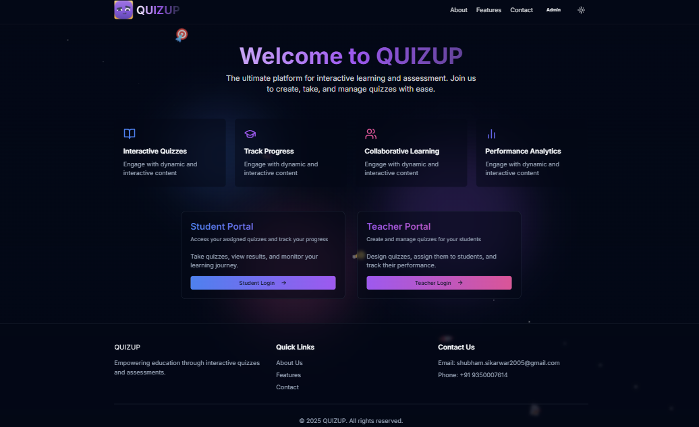
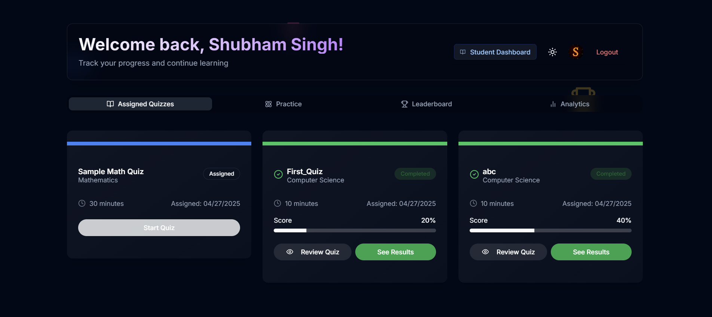
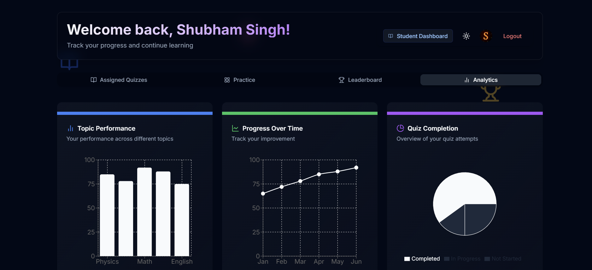
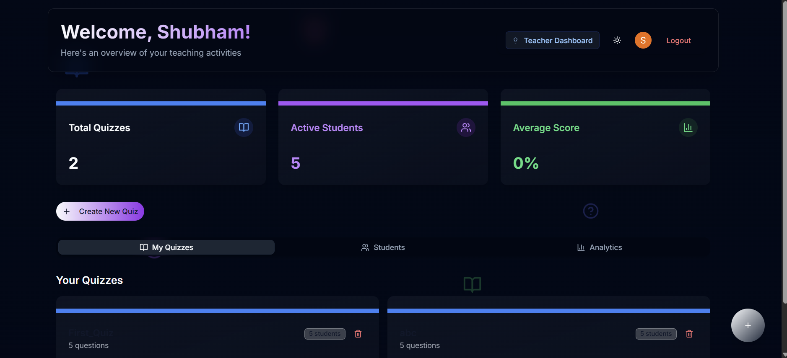
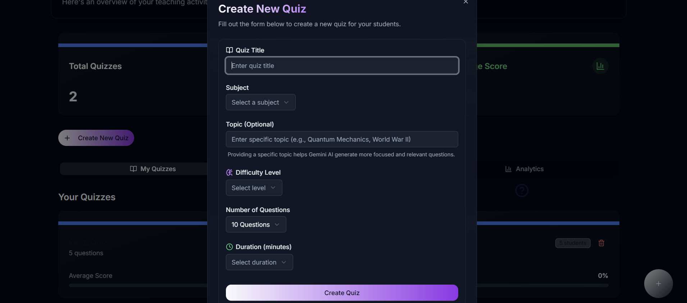

# <div align="center">🚀 QUIZUP - Interactive Learning Platform 🚀</div>

<div align="center">
  
  
  <h3>
    <span style="background: linear-gradient(to right, #8a2387, #e94057, #f27121); -webkit-background-clip: text; color: transparent; font-weight: bold; display: inline-block;">
      Quizup - AI POWERED LEARNING
    </span>
  </h3>

  <p>
    <a href="#video-explanation"></a>
    <a href="#features"></a>
    <a href="#tech-stack"></a>
    <a href="#getting-started"></a>
    <a href="#license"></a>
  </p>
</div>

<hr style="height: 3px; background: linear-gradient(to right, #8a2387, #e94057, #f27121); border: none; border-radius: 3px; margin: 30px 0;">

## 📌 Repository Information
<div style="background-color: rgba(13, 110, 253, 0.1); padding: 20px; border-radius: 15px; border-left: 5px solid #0d6efd; margin: 20px 0; box-shadow: 0 4px 6px rgba(50,50,93,.11), 0 1px 3px rgba(0,0,0,.08);">
  <strong style="font-size: 1.1em;">Repository Name:</strong> Shubham_Singh_CSE2_QUIZUP<br>
  <strong style="font-size: 1.1em;">Project Title:</strong> QUIZUP - Interactive Learning Platform<br>
  <strong style="font-size: 1.1em;">Course:</strong> Web Development Project
</div>

## 🎬 Video Explanation
<div align="center">
  <a href="https://drive.google.com/file/d/1BJJ2s4cF6ozPUuF9NyXXsF1PBFWGKSnA/view?usp=drive_link">
    
  </a>
  <p style="background-color: #FFF4CC; padding: 12px; border-radius: 8px; font-weight: bold; margin-top: 20px; color: #856404; border: 1px solid #ffeeba; display: inline-block;">
    <strong>🎥 👆 Click the image above to view the project demonstration video 👆 🎥</strong>
  </p>
</div>

## 📑 Final Project Report
<div align="center">
  <a href="./Final%20Project%20Report.pdf">
    
  </a>
  <p style="background-color: #E8F4FF; padding: 12px; border-radius: 8px; font-weight: bold; margin-top: 20px; color: #0366d6; border: 1px solid #c8e1ff; display: inline-block;">
    <strong>📄 The comprehensive project report includes detailed documentation, analysis, and insights about the QUIZUP platform development process 📄</strong>
  </p>
</div>

## 📝 Project Description

<p style="text-align: justify; padding: 15px; background-color: rgba(240, 240, 240, 0.3); border-radius: 10px; margin: 20px 0; box-shadow: 0 4px 6px rgba(50,50,93,.11), 0 1px 3px rgba(0,0,0,.08);">
QUIZUP is a modern, interactive quiz platform designed to revolutionize the way students learn and teachers teach. The application offers a dual interface for students and teachers, enabling personalized learning experiences and comprehensive teaching tools.
</p>

<p style="text-align: justify; padding: 15px; background-color: rgba(240, 240, 240, 0.3); border-radius: 10px; margin: 20px 0; box-shadow: 0 4px 6px rgba(50,50,93,.11), 0 1px 3px rgba(0,0,0,.08);">
The platform features interactive quizzes, real-time feedback, performance analytics, and a rich dashboard experience for both students and teachers. With QUIZUP, education becomes engaging, trackable, and tailored to individual needs.
</p>

## ✨ Features

<div style="display: flex; justify-content: space-between; flex-wrap: wrap; gap: 25px; margin: 30px 0;">
  <div style="flex: 1; min-width: 300px; background-color: rgba(134, 93, 255, 0.1); padding: 25px; border-radius: 15px; border-top: 5px solid #865DFF; box-shadow: 0 6px 12px rgba(0,0,0,0.1);">
    <h3 style="color: #865DFF; margin-bottom: 15px; display: flex; align-items: center; gap: 10px;">
      <span style="font-size: 1.4em;">🎓</span> Student Features
    </h3>
    <ul style="padding-left: 20px; line-height: 1.6;">
      <li>Interactive quiz participation</li>
      <li>Personalized learning dashboard</li>
      <li>Real-time performance analytics</li>
      <li>Progress tracking with visualizations</li>
      <li>Quiz history and review tools</li>
      <li>Practice sessions for skill improvement</li>
    </ul>
  </div>
  <div style="flex: 1; min-width: 300px; background-color: rgba(25, 195, 125, 0.1); padding: 25px; border-radius: 15px; border-top: 5px solid #19C37D; box-shadow: 0 6px 12px rgba(0,0,0,0.1);">
    <h3 style="color: #19C37D; margin-bottom: 15px; display: flex; align-items: center; gap: 10px;">
      <span style="font-size: 1.4em;">👨‍🏫</span> Teacher Features
    </h3>
    <ul style="padding-left: 20px; line-height: 1.6;">
      <li>Quiz creation and management</li>
      <li>Student performance monitoring</li>
      <li>Detailed analytics dashboard</li>
      <li>Assignment tools and scheduling</li>
      <li>Content management system</li>
      <li>Reporting and insights</li>
    </ul>
  </div>
</div>

## 🛠️ Tech Stack

<div align="center" style="margin: 30px 0;">
  <table style="width: 100%; border-collapse: separate; border-spacing: 0; border-radius: 15px; overflow: hidden; box-shadow: 0 10px 30px rgba(0,0,0,0.15);">
    <thead>
      <tr style="background: linear-gradient(45deg, #0062E6, #33AEFF);">
        <th style="padding: 15px; color: white; text-align: center; font-size: 1.1em;">Frontend</th>
        <th style="padding: 15px; color: white; text-align: center; font-size: 1.1em;">Backend</th>
        <th style="padding: 15px; color: white; text-align: center; font-size: 1.1em;">Authentication</th>
        <th style="padding: 15px; color: white; text-align: center; font-size: 1.1em;">Deployment</th>
      </tr>
    </thead>
    <tbody>
      <tr>
        <td style="padding: 20px; text-align: center; background-color: rgba(0, 98, 230, 0.05);">
          <br>
          <br>
          <br>
          
        </td>
        <td style="padding: 20px; text-align: center; background-color: rgba(0, 98, 230, 0.1);">
          <br>
          <br>
          
        </td>
        <td style="padding: 20px; text-align: center; background-color: rgba(0, 98, 230, 0.05);">
          
        </td>
        <td style="padding: 20px; text-align: center; background-color: rgba(0, 98, 230, 0.1);">
          <br>
          
        </td>
      </tr>
    </tbody>
  </table>
</div>

## 🚀 Getting Started

<div style="background-color: rgba(40, 167, 69, 0.1); padding: 25px; border-radius: 15px; border-left: 5px solid #28a745; margin: 30px 0; box-shadow: 0 8px 16px rgba(0,0,0,0.1);">

1. **Clone the repository**
   ```bash
   git clone https://github.com/shubhxmsingh/Shubham_Singh_CSE2_QUIZUP.git
   cd Shubham_Singh_CSE2_QUIZUP
   ```

2. **Install dependencies**
   ```bash
   npm install
   ```

3. **Set up environment variables**
   Create a `.env.local` file in the root directory:
   ```env
   # Clerk Authentication
   NEXT_PUBLIC_CLERK_PUBLISHABLE_KEY=your_publishable_key
   CLERK_SECRET_KEY=your_secret_key

   # Database
   DATABASE_URL=your_database_url

   # Other configurations
   NEXT_PUBLIC_APP_URL=http://localhost:3000
   ```

4. **Set up the database**
   ```bash
   npx prisma generate
   npx prisma db push
   ```

5. **Run the development server**
   ```bash
   npm run dev
   ```

6. **Open your browser**
   Navigate to [http://localhost:3000](http://localhost:3000)
</div>

## 👥 Team Members

<div align="center" style="margin: 30px 0;">
  <div style="background-color: #f8f9fa; padding: 25px; border-radius: 15px; display: inline-block; margin: 0 auto; box-shadow: 0 10px 30px rgba(0,0,0,0.15);">
    <h3 style="margin: 15px 0 5px 0; color: #333; font-size: 1.4em;">Shubham Singh</h3>
    <h3 style="margin: 15px 0 5px 0; color: #333; font-size: 1.4em;">Rachit Garg</h3>
    <h3 style="margin: 15px 0 5px 0; color: #333; font-size: 1.4em;">Nikhil Singh</h3>
    <h3 style="margin: 15px 0 5px 0; color: #333; font-size: 1.4em;">Harsh Tewatia</h3>
    </a>
  </div>
</div>

## 📊 Project Highlights

<div align="center" style="margin: 30px 0;">
  
  <p style="font-style: italic; color: #6c757d; font-size: 1.1em; margin-top: 10px;">Student Dashboard</p>
</div>

<div style="display: flex; justify-content: space-between; flex-wrap: wrap; gap: 30px; margin: 40px 0;">
  <div style="flex: 1; min-width: 300px;">
    
    <p align="center" style="font-style: italic; color: #6c757d; font-size: 1.1em; margin-top: 10px;">Student Analytics</p>
  </div>
  <div style="flex: 1; min-width: 300px;">
    
    <p align="center" style="font-style: italic; color: #6c757d; font-size: 1.1em; margin-top: 10px;">Teacher Management Panel</p>
  </div>
</div>

<div align="center" style="margin: 40px 0;">
  
  <p style="font-style: italic; color: #6c757d; font-size: 1.1em; margin-top: 10px;">Create Quiz</p>
</div>

## 📄 License

<div align="center" style="margin: 30px 0;">
  <a href="LICENSE">
    
  </a>
</div>

<div style="background-color: rgba(108, 117, 125, 0.1); padding: 20px; border-radius: 15px; border-left: 5px solid #6c757d; margin: 30px 0; box-shadow: 0 8px 16px rgba(0,0,0,0.1);">
  <p style="margin-bottom: 15px;">This project is licensed under the MIT License - see the <a href="LICENSE" style="color: #0366d6; font-weight: bold; text-decoration: none;">LICENSE</a> file for details.</p>
  
  <details style="margin-top: 15px;">
    <summary style="cursor: pointer; font-weight: bold; color: #0366d6; padding: 8px; background-color: rgba(3, 102, 214, 0.05); border-radius: 8px;">View License Text</summary>
    <div style="margin-top: 15px; padding: 20px; background-color: rgba(255, 255, 255, 0.8); border-radius: 10px; border: 1px solid #d1d5da; box-shadow: 0 4px 8px rgba(0,0,0,0.05);">
      <pre style="margin: 0; white-space: pre-wrap; color: #333;">MIT License

Copyright (c) 2023 Shubham Singh

Permission is hereby granted, free of charge, to any person obtaining a copy
of this software and associated documentation files (the "Software"), to deal
in the Software without restriction, including without limitation the rights
to use, copy, modify, merge, publish, distribute, sublicense, and/or sell
copies of the Software, and to permit persons to whom the Software is
furnished to do so, subject to the following conditions:

The above copyright notice and this permission notice shall be included in all
copies or substantial portions of the Software.

THE SOFTWARE IS PROVIDED "AS IS", WITHOUT WARRANTY OF ANY KIND, EXPRESS OR
IMPLIED, INCLUDING BUT NOT LIMITED TO THE WARRANTIES OF MERCHANTABILITY,
FITNESS FOR A PARTICULAR PURPOSE AND NONINFRINGEMENT. IN NO EVENT SHALL THE
AUTHORS OR COPYRIGHT HOLDERS BE LIABLE FOR ANY CLAIM, DAMAGES OR OTHER
LIABILITY, WHETHER IN AN ACTION OF CONTRACT, TORT OR OTHERWISE, ARISING FROM,
OUT OF OR IN CONNECTION WITH THE SOFTWARE OR THE USE OR OTHER DEALINGS IN THE
SOFTWARE.</pre>
    </div>
  </details>
</div>

## 📞 Contact

<div style="background-color: rgba(13, 202, 240, 0.1); padding: 25px; border-radius: 15px; border-left: 5px solid #0dcaf0; margin: 30px 0; box-shadow: 0 8px 16px rgba(0,0,0,0.1);">
  <table style="width: 100%; border: none;">
    <tr>
      <td style="width: 40px; vertical-align: middle; padding: 10px 0;"></td>
      <td style="padding: 10px 0;"><a href="mailto:shubham.sikarwar2005@gmail.com" style="color: #0366d6; text-decoration: none; font-weight: 500;">shubham.sikarwar2005@gmail.com</a></td>
    </tr>
    <tr>
      <td style="width: 40px; vertical-align: middle; padding: 10px 0;"></td>
      <td style="padding: 10px 0;"><span style="font-weight: 500;">+91 9350007614</span></td>
    </tr>
    <tr>
      <td style="width: 40px; vertical-align: middle; padding: 10px 0;"></td>
      <td style="padding: 10px 0;"><span style="font-weight: 500;">Ghaziabad, India</span></td>
    </tr>
  </table>
</div>

---

<div align="center" style="margin: 30px 0;">
  <p style="margin-bottom: 15px; font-size: 1.1em;">
    
    by Shubham Singh
  </p>
  
  <a href="https://github.com/shubhxmsingh">
    
  </a>
</div>

